<!-- Nguyễn Huy Hiệu (Nguyen Huy Hieu) — Software Engineer @ OPSWAT, Founder of techjobs.vn. AI/LLM security, Kubernetes security (CKS), full-stack, DevSecOps. Hà Nội, Việt Nam. -->

<a href="https://techjobs.vn">
  <picture>
    <source media="(prefers-color-scheme: dark)" srcset="./assets/banner-dark.svg">
    <source media="(prefers-color-scheme: light)" srcset="./assets/banner-light.svg">
    
  </picture>
</a>

<h1 align="center">Hi, I'm Nguyễn Huy Hiệu 👋</h1>

  <b>Software Engineer @ OPSWAT</b> · <b>Founder of <a href="https://techjobs.vn">techjobs.vn</a></b> 
  I build secure systems and tools for developers — from AI/LLM vulnerability research to Kubernetes security and full-stack products.

  
  
  
  

---

### ⚡ Now

- 🛡️ **Software Engineer at [OPSWAT](https://www.opswat.com)** — a global cybersecurity company protecting critical infrastructure.
- 🧠 **Building [`aivulndb`](https://github.com/zohuyhieuzo03/aivulndb)** — a normalized, cross-linked database of AI/LLM vulnerabilities (infra · model · artifact · agent layers, incl. MCP tool poisoning & prompt injection).
- ☸️ **Preparing for CKS** (Certified Kubernetes Security Specialist) — exam Oct 2026.
- 🚀 **Running [techjobs.vn](https://techjobs.vn)** — connecting Vietnamese developers with great tech jobs.

### 🧰 Featured projects

| Project | What it does | Stack |
|---|---|---|
| [**aivulndb**](https://github.com/zohuyhieuzo03/aivulndb) | Unifies GHSA, OSV, NVD, huntr & vendor advisories into one record per AI vulnerability, with calibrated auto-classification | Python |
| [**techjobs.vn**](https://techjobs.vn) | IT job board & developer community for Vietnam | Full-stack |
| [**AI-Prompt-Store**](https://github.com/zohuyhieuzo03/AI-Prompt-Store) | Store for sharing & discovering AI prompts · [live](https://ai-prompt-store.vercel.app) | Next.js · Supabase |
| [**voz_summarize**](https://github.com/zohuyhieuzo03/voz_summarize) | Telegram bot that crawls long VOZ forum threads and summarizes them with Gemini | Python · Flask |
| [**ExpenseTracker**](https://github.com/zohuyhieuzo03/ExpenseTracker) | Telegram bot for tracking personal expenses | Python |

### 🏆 Competitive programming & awards

- 🥇 **Special Prize** — Naprock Procon, Japan 2024
- 🏆 **Champion** — Vietnam National Procon 2023
- 🥉 **Third Prize** — ICPC Asia Hanoi Regional 2021
- 🥈 **Second Prize** — ICPC Vietnam National 2021
- 🥇 **First Prize** — IAI Hackathon (UET) 2023 · Coding Inspiration Hackathon 2023

### 🛠️ Tech stack

  <picture>
    <source media="(prefers-color-scheme: dark)" srcset="https://skillicons.dev/icons?i=py,go,ts,ruby,react,vue,nodejs,fastapi,flutter,docker,kubernetes,aws,gcp,postgres,redis,linux,githubactions&perline=17&theme=dark">
    
  </picture>

**Focus areas:** AI/LLM security · Kubernetes & cloud-native security · DevSecOps & CI/CD · Backend & distributed systems · Algorithms

### 💼 Experience

| When | Where | Role |
|---|---|---|
| 2026 – now | **OPSWAT** (cybersecurity) | Software Engineer |
| 2024 – 2026 | **Remitano** (crypto exchange) | Full-stack Developer — KYC service, anomaly detection on AWS CloudWatch |
| 2023 – 2024 | **Teko** | Software Engineer — FastAPI, Go monorepo, Flutter, CI/CD (-20% build time) |
| 2022 – 2023 | **VNU-UET SE Lab** | Researcher — source code dependency analysis (+60% speed), published paper |

🎓 B.Sc. Information Technology — VNU University of Engineering and Technology (UET), Hà Nội.

<b>🇻🇳 Giới thiệu bằng tiếng Việt</b>

 

Mình là **Nguyễn Huy Hiệu**, kỹ sư phần mềm tại Hà Nội, hiện là **Software Engineer tại OPSWAT** và là **founder của [techjobs.vn](https://techjobs.vn)** — nền tảng **việc làm IT** kết nối lập trình viên Việt Nam với các công ty công nghệ.

Mình quan tâm tới **bảo mật AI/LLM**, **bảo mật Kubernetes (CKS)**, **DevSecOps** và phát triển **full-stack**. Cựu sinh viên **UET – ĐHQGHN**, từng đạt giải **ICPC** và **vô địch Procon Việt Nam 2023**.

Đang tìm việc IT hoặc cần tuyển dev? Ghé **[techjobs.vn](https://techjobs.vn)** nhé!

### 🐍 Contributions

<picture>
  <source media="(prefers-color-scheme: dark)" srcset="https://raw.githubusercontent.com/zohuyhieuzo03/zohuyhieuzo03/output/github-snake-dark.svg">
  
</picture>

⭐ If something here is useful to you, a star helps a lot · Open to security research collabs & talks

